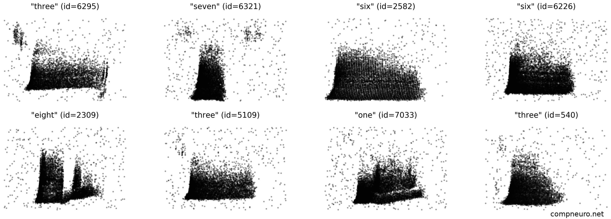

# 2024 Summer School in Computational Biology @ UC

## Group Project: *Machine Learning approaches for finding structure in neural data*
[Project presentation](https://slides.com/renatocfduarte/cnc-template-be532f?token=L8bFFxRC)

In this project, you will be analyzing a synthetic dataset which represents the activity of cochlear nuclei when stimulated by
specific auditory input. 
The dataset was designed as a machine learning benchmark for spiking neural networks, but we will be
using a sub-set of it as an example of neural population activity. The whole dataset, along with its purpose
and how it was generated is documented [here](https://ieeexplore.ieee.org/document/9311226) and openly available
[here](https://zenkelab.org/resources/spiking-heidelberg-datasets-shd/). We will focus on the spoken digit
recognition sub-set, comprising a set of audio recordings of spoken single digits 
fed through a hydrodynamic basilar membrane (BM) model and subsequently converted 
to phase-coded spikes with a transmitter-pool based hair cell (HC) model. This pre-processing pipeline
was designed to mirror the encoding of auditory information by the Hair Cells of the cochlear nucleus. The resulting
spiking activity of a population of 700 cochlear cells is depicted below.



We will be using (a small sub-set of) this dataset to analyse encoded representations in distributed population activity.

The aim of the project is to analyse the geometry of neural representations. In that sense, this
dataset is very adequate, as there are clearly discernible spatiotemporal patterns in the activity of the
(emulated) cochlear neurons. 


### **Preliminaries:** Setting up project requirements and libraries

#### 1) Cloning the repository
This repository contains all you will need to work on the project. So, start by cloning it:
```shell
git clone git@github.com:rcfduarte/computational-biology-2024.git
```

If you have never worked with `git` or are unfamiliar with it, have a quick look at this [short introduction](https://docs.github.com/en/get-started/getting-started-with-git/set-up-git).

**Note:** If you run into any trouble or are unable to clone the repository, please try to discuss with your colleagues that
may be more experienced with git or contact the course tutor.


#### 2) Setting up a virtual environment
As the project requires some specific libraries, it is recommended that you setup a [conda](https://docs.anaconda.com/) virtual environment. If you are
unfamiliar with the notion of virtual environments, don't get scared, all you will need to set it up is provided in the repository:

Install conda via the link above and create a new project environment:

```shell
conda env create -f conda_venv.yml
```

Don't forget to load it and activate it before running the code:
```shell
conda activate computational-biology-2024
```


#### 3) Load dataset
To ensure everything is setup properly run `test_loader.py`. If it works properly, it should output something similar to the figure below:


---

### Tutorial & Example

Once you have everything set up and running, go through the tutorial notebook [tutorial_example.ipynb](tutorial_example.ipynb).
Examine it carefully. There are a set of tools provided that already implement relevant functionality. Try to understand the
use of the `SpikeList` and `StateMatrix` classes in the examples and check the source code (in `tools/analysis/`) as these 
comprise a lot of potentially useful metrics and methods.

### Project

The tutorial ends with the application of Principal Component Analysis (PCA) to the dataset. A natural extension is the application
of different dimensionality reduction and manifold learning algorithms. In the project presentation and below, 
I leave some suggestions for algorithms you may want to try:

1. Principal Component Analysis (PCA)
2. Multi-Dimensional Scaling (MDS)
3. Isomap Embedding
4. Locally Linear Embedding (LLE)
5. Laplacian Eigenmaps (LEM) or Spectral Embedding
6. t-distributed Stochastic Neighbour Embedding (t-SNE)
7. Uniform Manifold Approximation and Projection (UMAP)

Ideally, you should compare their performance looking at, for example, the ability to reconstruct the original states
from the embedding, or the ability to classify the different label identities from the embedding.

